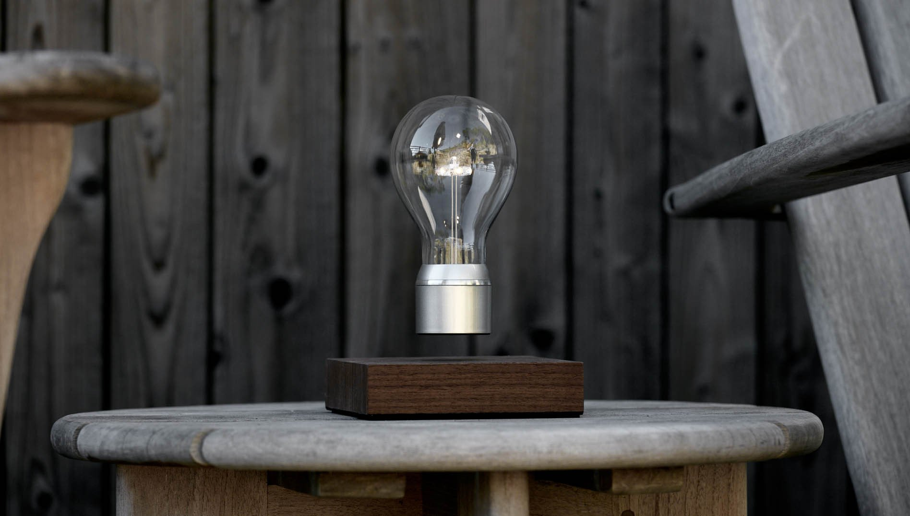
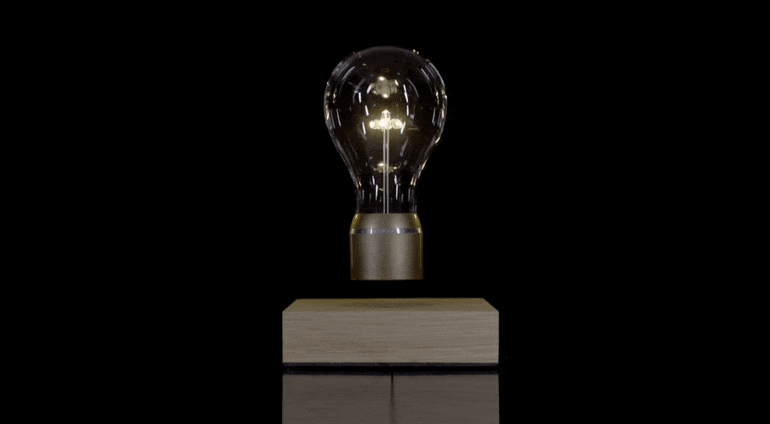

  
  <h2 align="center">Amazing Products</h2>
  
Collecting Amazing Product

  

		<a href="https://github.com/Joevonlong/amazingproducts#product"><#一个图片的链接#"/></a>

  

   

## Content

- [Record format](#recordformat)
- [Other Catalogs](#othercatalogs)
- [应用领域整理](#scene)
- [Product Hub](#producthub)
- [Waiting List](#waitinglist)

- [License](#license)

## <h2 id="recordformat"> Record Format </h2>

### 
 Product Name 

#### 
  

#### 产品简介
##### 用途

介绍

#### Price: 
#### [产品官方链接](Link)

## <h2 id="othercatalogs"> Other Catalogs </h2>
[Care and Beauty](./othercatalogs/care_and_beauty.md)

## <h2 id="scene"> Application Scene </h2>
本章节是物品的打散与从新整理。相当于不同人的不同选取。在某一个应用领域，或者某一个应用场景中，选取出一些很棒的产品。产生一个个Scene 列表单子。比如：对摄影领域，你觉得有哪些好用的产品。

[飓风影视的一个小种草清单](https://www.youtube.com/watch?v=0r7HNUfZZO0)

## <h2 id="producthub"> Product Hub </h2>

### 
 Flyte Light 

#### 悬浮灯泡
##### 灯泡

Flyte的灯具将磁悬浮、无线充电和优秀的产品设计都结合到了一起，科技与设计的结合瞬间提升家居的美感与创意。灯泡会徘徊在其底座上方，提供了一个独特的方式来照亮房间。

#### Price: 
#### [Link: FlyteStore](https://flytestore.com/)

## <h2 id="waitinglist"> Waiting List </h2>
- CSYS by Jake Dyson Light

## <h2 id="license"> License </h2>

